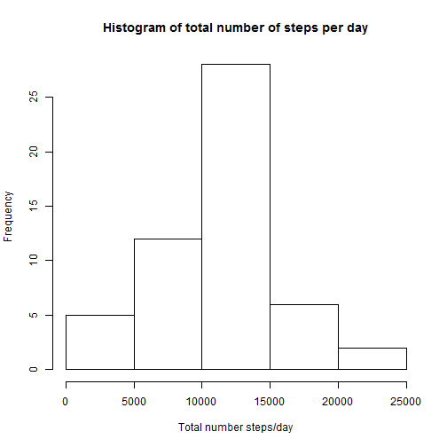
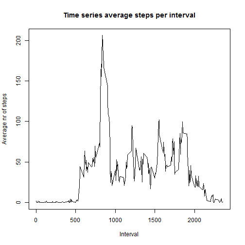
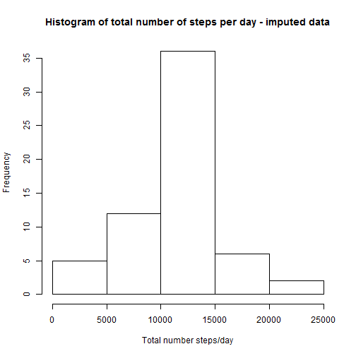
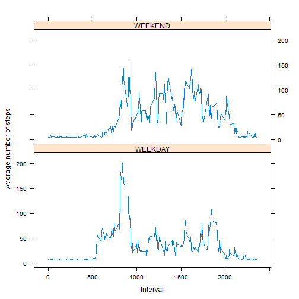

R code for completing Assignment 1 in Coursera Reproducible Research course

Step 1- Code for reading in the dataset and/or processing the data

We assume that the zipped datafile activity.zip  is in the workdirectory

We create a new column containing index or rownumber


```r
library(lattice)
library(plyr)

unzip("activity.zip",overwrite=TRUE)
dataset<-read.csv("activity.csv",header=TRUE,sep=",")
dataset$index<-1:dim(dataset)[1]
```

We now create a histogram to plot the data


```r
stepsperday<-tapply(dataset$steps,dataset$date,sum)
hist(stepsperday,main="Histogram of total number of steps per day",xlab="Total number steps/day")
```



And report the mean and median per day:


```r
medianperday<-median(stepsperday,na.rm=TRUE)
meanperday<-mean(stepsperday,na.rm=TRUE)
result<-cbind(meanperday,medianperday)
colnames(result)<-c("Mean","Median")
print(result)
```

```
##          Mean Median
## [1,] 10766.19  10765
```


Step 4- Time series plot of the average number of steps taken


```r
stepsperinterval<-tapply(dataset$steps,dataset$interval,mean,na.rm=TRUE)
plot(as.numeric(rownames(stepsperinterval)),stepsperinterval,type="l",main="Time series average steps per interval",xlab="Interval",ylab="Average nr of steps")
```



Step 5- The 5-minute interval that, on average, contains the maximum number of steps


```r
maxsteps<-max(stepsperinterval,na.rm=TRUE)
print(stepsperinterval[stepsperinterval==maxsteps])
```

```
##      835 
## 206.1698
```

Step 6- Code to describe and show a strategy for imputing missing data

Report number of missing values


```r
print(sum(is.na(dataset$steps)))
```

```
## [1] 2304
```

We take a naive approach and replace all missing values with the average value of the total dataset
This drives both the mean and median value up


```r
cleandataset<-dataset

imputevalue<-mean(dataset$steps,na.rm=TRUE)
cleandataset$steps[is.na(dataset$steps)]<-imputevalue
```

Step 7- Histogram of the total number of steps taken each day after missing values are imputed


```r
cleanstepsperday<-tapply(cleandataset$steps,cleandataset$date,sum)
hist(cleanstepsperday,main="Histogram of total number of steps per day - imputed data",xlab="Total number steps/day")
```



```r
cleanmedianperday<-median(cleanstepsperday,na.rm=TRUE)
cleanmeanperday<-mean(cleanstepsperday,na.rm=TRUE)
cleanresult<-cbind(cleanmeanperday,cleanmedianperday)
colnames(cleanresult)<-c("Mean","Median")
print(cleanresult)
```

```
##          Mean   Median
## [1,] 10766.19 10766.19
```

Step 8- Panel plot comparing the average number of steps taken per 5-minute interval across weekdays and weekends


```r
whatkindofday<-weekdays(as.Date(cleandataset$date))
weekend<-as.factor((whatkindofday=="zondag") | (whatkindofday=="zaterdag"))
toplot<-cbind(cleandataset,weekend)
levels(toplot$weekend)<-c("WEEKDAY","WEEKEND")
weekvalues<-toplot[toplot$weekend=="WEEKDAY",]
weekendvalues<-toplot[toplot$weekend=="WEEKEND",]


stepsperintervalweek<-tapply(weekvalues$steps,weekvalues$interval,mean,na.rm=TRUE)
stepsperintervalweekend<-tapply(weekendvalues$steps,weekendvalues$interval,mean,na.rm=TRUE)


set1<-cbind(stepsperintervalweek,as.integer(rownames(stepsperintervalweek)),(rep(0,length(stepsperintervalweek))))
set2<-cbind(stepsperintervalweekend,as.integer(rownames(stepsperintervalweekend)),(rep(1,length(stepsperintervalweekend))))

set1<-as.data.frame(set1)
set2<-as.data.frame(set2)

set1<-rename(set1, c("stepsperintervalweek"="steps", "V2"="Interval","V3"="Weekend"))
set2<-rename(set2, c("stepsperintervalweekend"="steps", "V2"="Interval","V3"="Weekend"))


toplot<-rbind(set1,set2)

toplot$Weekend<-as.factor(toplot$Weekend)
levels(toplot$Weekend)<-c("WEEKDAY","WEEKEND")

xyplot(steps ~ Interval | Weekend, data=toplot, layout=c(1,2),ylab="Average number of steps", xlab="Interval", type="l")
```



That's it! 
